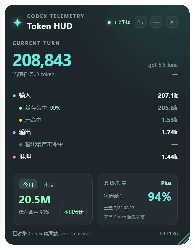

# Codex Token HUD Monitor

把 Codex 的 token 使用情况固定在桌面角落：一个原生 Windows 透明 HUD，实时显示当前任务、input/output/reasoning、缓存命中率、今日/本周累计、API 等价美元估算，以及当前套餐剩余用量。无需切换窗口，也不用打开额外网页。



> 截图展示：左侧是当前任务与缓存明细，右侧是当前套餐、剩余百分比和重置时间。

## 项目优势

- **实时可见**：直接读取 Codex Desktop session 的 usage 事件，当前任务、输入、输出和 reasoning 一目了然。
- **缓存透明**：拆分显示 cached input、uncached input 和 input cache hit rate，方便判断上下文复用效果。
- **日周统计**：按本机时区累计今日与本周 token，支持跨任务查看本机使用趋势。
- **费用估算**：按当前模型的 OpenAI API input、cached input、output 单价估算美元费用，日周累计支持多模型分别计价。
- **套餐余量**：通过 Codex 自带 app-server 读取当前套餐、剩余百分比和窗口重置时间；登录状态不可用时安全降级为未获取。
- **桌面友好**：透明置顶、右下角启动、顶部拖动、等比例缩放、普通缩小与系统托盘收纳，并提供退出按钮。
- **本地优先**：采集器只监听 `127.0.0.1`，不上传 prompt、session 内容或 token 数据。
- **开箱下载**：GitHub Release 同时提供 Windows 安装包和 Codex 插件 ZIP。

## 下载与安装

项目通过 [GitHub Public Repository](https://github.com/q1062638324/codex-token-hud-monitor) 发布，任何人都可以下载 Release。

每个 Release 提供两类文件：

- `*.msi` 或 `*-setup.exe`：Windows 桌面 HUD 安装包。
- `codex-token-hud-monitor-plugin-*.zip`：完整 Codex 插件包。

安装步骤：

1. 下载并运行 Windows 安装包。
2. 下载插件压缩包，将其中的插件目录安装到 Codex 的个人插件目录。
3. 重启 Codex Desktop，`SessionStart` hook 会自动启动本地采集器。
4. HUD 会在桌面右下角启动，可拖动、缩放、缩小为桌面图标。

仓库打 tag 后，GitHub Actions 会自动构建 Windows 安装包和插件压缩包，并创建 Draft Release。

## 已实现

- 当前任务的 input、cached input、uncached input、output、reasoning output。
- 输入缓存命中率和输出缓存字段（数据源提供时显示）。
- 本地每日、每周累计，按本机时区切分。
- 当前任务、今日和本周的 OpenAI API 等价美元费用估算，缓存命中 input 使用 Cached Input 单价。
- 当前套餐类型、主/次额度窗口剩余百分比和重置时间。
- `codex exec --json` 的 `turn.completed.usage` 采集。
- Codex 桌面端 session 的 `last_token_usage` 和 `total_token_usage` 采集。
- OTLP JSON 与 OTLP HTTP Protobuf 的基础采集入口。
- Tauri 透明、置顶、无边框窗口。
- 启动时定位到主显示器右下角，拖动顶部标题栏即可移动。
- 拖动右下角缩放手柄可等比例调整窗口大小。

## 目录

- `app/`：Tauri HUD 桌面应用。
- `scripts/hudctl.py`：本地状态服务与 usage 采集器。
- `hudctl.py` 会读取 Codex 的 `state_5.sqlite` 找到 session JSONL，并跟踪其中的 `token_count` 事件。
- `scripts/run-codex.ps1`：通过 `codex exec --json` 运行并转发 usage。
- `hooks/hooks.json`：Codex 会话启动时启动本地采集服务。

## 开发运行

在插件目录执行：

```powershell
python .\scripts\hudctl.py ensure
cargo run --manifest-path .\app\src-tauri\Cargo.toml
```

若只想测试采集器：

```powershell
Get-Content .\tests\sample-turn.jsonl | python .\scripts\hudctl.py ingest
```

## Codex JSONL 包装运行

```powershell
.\scripts\run-codex.ps1 -Prompt "总结当前仓库"
```

该脚本会把 Codex 输出原样写到 stdout，并把 `turn.completed` 事件发送到本地 HUD。

## OTel 接入

Codex 当前版本的 OTel 配置字段和传输格式可能随版本变化，建议先按当前版本的官方配置启用本地 OTLP exporter，再将 endpoint 指向：

```text
http://127.0.0.1:38427/v1/ingest
```

采集器只接受 localhost，不会把 prompt 或 token 发到外部服务。

## 说明

每日和每周是本机采集累计，不等同于账户级套餐额度。费用是 API 等价估算，不是 Codex 订阅账单；价格表位于 `config/pricing.json`，来源和更新时间也记录在其中，可按需要更新。缓存命中的 input 按 Cached Input 价格计算，reasoning 已包含在 output usage 中，不会重复计费。历史数据如果没有模型归属会显示 `—`，避免用错误模型价格伪造金额。套餐余量通过本机 Codex CLI 的 `app-server` 调用 `account/rateLimits/read` 获取，HUD 只保存套餐类型、百分比、窗口时间和 credits 状态，不读取或保存认证密钥。未登录、CLI 版本过旧或 Codex 暂时未返回数据时，套餐卡片会显示“未获取”。
